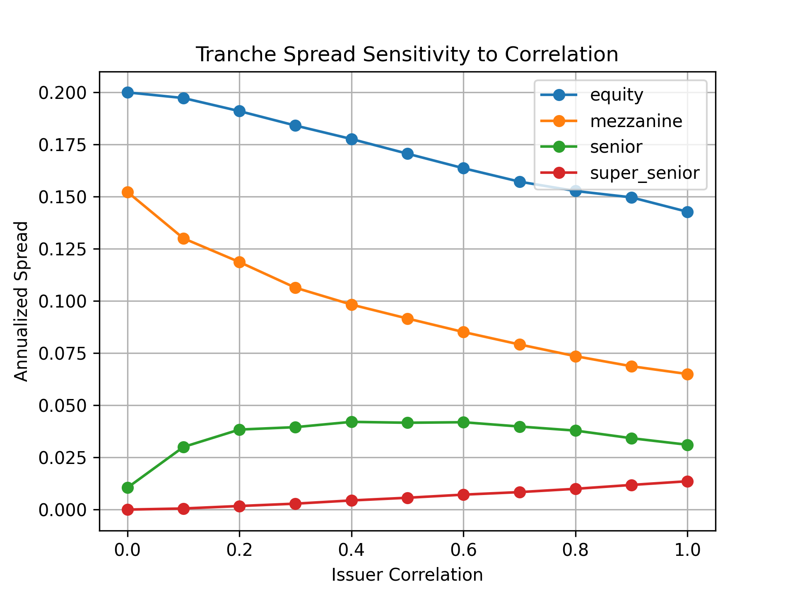

# Synthetic CDO Tranche Pricing via Monte Carlo Simulation

This project models and prices tranches of a synthetic Collateralized Debt Obligation (CDO) using a Monte Carlo simulation based on a one-factor Gaussian copula. The model captures correlated defaults across a credit portfolio and computes break-even spreads for different tranches.

## Project Overview

The simulation combines CDS-implied default intensities with historical return-based market correlations. It supports both public and private issuers, using SPY correlations for public names and sector-level averages for private ones.

Features:
- Derives default intensities from CDS spreads
- Uses SPY correlation to estimate issuer-level exposure to systemic risk
- Simulates correlated default times using a one-factor Gaussian copula
- Calculates expected tranche losses and annualized break-even spreads
- Evaluates sensitivity of tranche pricing to changes in correlation structure
- Quantifies estimation uncertainty with standard error bounds

## Methodology

1. **Data Preparation**
   - Extract HYCDX constituent data and clean issuer identifiers
   - Identify public tickers and map private issuers to sectors

2. **Correlation Estimation**
   - Download weekly equity returns using Yahoo Finance (`yfinance`)
   - Compute issuer-to-SPY correlations
   - Assign sector-average correlations to private issuers

3. **Monte Carlo Simulation**
   - Simulate latent variables using the one-factor copula:

   $$
   X_i = \sqrt{\rho_i} \times M + \sqrt{1 - \rho_i} \times Z_i
   $$
   - Transform to uniform space via standard normal CDF
   - Convert to default times using inverse exponential CDF
   - Determine defaults based on thresholds implied by default intensities

4. **Tranche Pricing**
   - Aggregate portfolio losses across simulations
   - Map portfolio loss to tranche-specific losses using attachment/detachment
   - Compute average loss and divide by maturity to estimate break-even spread
   - Estimate standard error to assess simulation precision

5. **Sensitivity Analysis**
   - Vary correlation uniformly across the portfolio
   - Track and plot tranche spread response to changes in systemic correlation

## Tranche Definitions and Pricing Results

| Tranche        | Attachment | Detachment | Fair Spread (%) | Error Bound (± %) |
|----------------|------------|------------|-----------------|-------------------|
| Equity         | 0%         | 5%         | 17.63%          | ±0.05%            |
| Mezzanine      | 5%         | 15%        | 9.36%           | ±0.08%            |
| Senior         | 15%        | 25%        | 4.10%           | ±0.07%            |
| Super Senior   | 25%        | 100%       | 0.54%           | ±0.02%            |

## Correlation Sensitivity Analysis
The following plot shows how tranche spreads change with varying default correlation levels:

